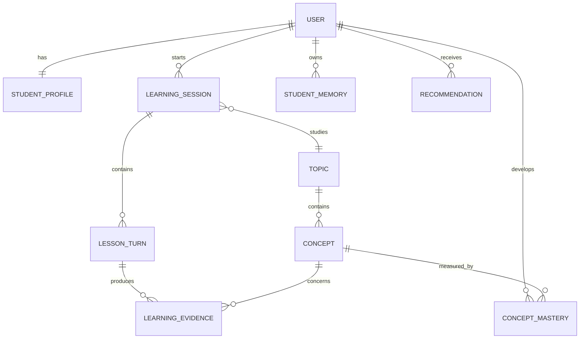

# Planned data model

This is a logical schema, not an implemented migration. PostgreSQL is the proposed initial database.

## Entity relationship overview

## Core tables

### `users`

Maps the Clerk identity to application data.

| Field | Notes |
|---|---|
| `id` | Internal UUID |
| `clerk_user_id` | Unique external identity |
| `created_at`, `updated_at` | Audit timestamps |

### `student_profiles`

| Field | Notes |
|---|---|
| `user_id` | One-to-one with user |
| `grade_level` | Declared school level |
| `goals` | Structured JSON initially |
| `preferred_depth` | Short, balanced, or detailed |
| `profile_version` | Supports future migrations |

### `topics` and `concepts`

Topics are broad areas such as Gravity. Concepts are assessable units such as Mass vs Weight or Orbital Motion. Concepts may reference prerequisites through a separate relationship table.

### `learning_sessions`

| Field | Notes |
|---|---|
| `id`, `user_id`, `topic_id` | Ownership and subject |
| `status` | Active, paused, completed, abandoned |
| `current_action` | Current state-machine action |
| `summary` | Compact server-approved session summary |
| `model_conversation_id` | Optional provider conversation reference |
| `last_active_at` | Continue-learning ordering |

### `lesson_turns`

Stores student and teacher turns, the UI block returned, model/config version, and status. Sensitive raw content retention must be decided before production.

### `learning_evidence`

Immutable observations tied to a concept and source turn. Corrections should append superseding evidence rather than silently rewriting history.

### `concept_mastery`

A derived snapshot containing score, confidence, status, last assessed time, and next review time. It must be reproducible from evidence plus an algorithm version.

### `student_memories`

| Field | Notes |
|---|---|
| `type` | Preference, interest, goal, misconception, strategy success |
| `content` | Human-readable statement |
| `structured_value` | Optional machine-readable value |
| `confidence` | System confidence, not mastery |
| `source_turn_id` | Provenance |
| `student_confirmed` | Explicit confirmation state |
| `active` | Supports reversible deletion/archival |
| `last_used_at` | Helps memory retrieval and cleanup |
| `embedding` | Optional vector for semantic retrieval |

### `recommendations`

Stores generated/ranked suggestions with reason, source evidence, score, expiry, and dismissed/opened state. Never show a recommendation without a student-readable reason.

## Data ownership rules

- Every student-specific query is scoped by authenticated internal `user_id`.
- Provider conversation IDs are references, not the durable source of truth.
- Deleting a learner account must cascade or anonymize related data according to the final retention policy.
- Memory and recommendation records need user-facing delete/dismiss controls.
- Store algorithm and prompt versions with derived decisions for debugging.
