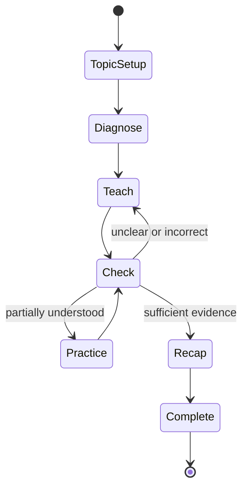

# Faraday Learning Engine

## Purpose

The Learning Engine turns a general language model into a consistent personal teacher. The model writes language; the engine controls the lesson.

## Components

### Student Model

The durable representation of the learner:

- Grade and declared goals
- Interests and teaching preferences
- Topic and concept mastery
- Misconceptions and unresolved questions
- Past learning evidence
- Active and completed learning paths
- Review schedule and recommended next action

### Context Builder

Loads only context relevant to the current turn:

```text
Stable teaching policy
+ student level and preferences
+ active topic and selected subtopic
+ strongest relevant memories
+ current mastery and misconceptions
+ compact session summary
+ latest student message
```

Do not send every historical message on every request.

### Teaching Orchestrator

Chooses exactly one next action:

- `diagnose`
- `teach`
- `check_understanding`
- `give_hint`
- `reteach_differently`
- `practice`
- `recap`
- `complete_lesson`

The model may recommend an action, but application rules validate whether it is allowed.

### Model Adapter

Owns provider-specific API calls. It accepts a provider-neutral request and returns a validated Faraday result. Model IDs, reasoning effort, token limits, and timeouts are configuration.

### Evidence and Mastery Engine

Every meaningful response may create evidence:

```ts
type LearningEvidence = {
  conceptId: string;
  kind: "correct_answer" | "incorrect_answer" | "self_explanation" | "hint_used" | "student_uncertain";
  strength: number;
  sourceTurnId: string;
  observedAt: string;
};
```

Mastery is derived from accumulated evidence. Pressing “I got it” is useful evidence, but cannot independently mark a concept mastered.

### Memory Service

The memory service creates candidates rather than silently treating every statement as permanent truth.

Memory categories:

- `preference`: “Likes practical examples.”
- `interest`: “Enjoys astronomy.”
- `goal`: “Preparing for a Grade 10 exam.”
- `misconception`: “Confuses mass and weight.”
- `strategy_success`: “A diagram clarified orbital motion.”

Each memory stores provenance, confidence, creation time, last-use time, and whether the student confirmed it.

## Lesson state machine



## Structured model result

The model response should conform to a server-validated schema:

```json
{
  "teacherMessage": "Let's use a cricket-ball example.",
  "ui": {
    "type": "choice_question",
    "prompt": "What keeps the ball moving forward?",
    "choices": [
      { "id": "a", "label": "Its existing motion" },
      { "id": "b", "label": "A constant forward force" },
      { "id": "unsure", "label": "I'm not sure yet" }
    ]
  },
  "conceptId": "orbital-motion",
  "recommendedAction": "check_understanding",
  "memoryCandidates": [],
  "evidenceCandidates": []
}
```

The server assigns database identifiers and timestamps. The model cannot declare a student mastered or directly persist memory.

## Prompt layers

1. **Teaching policy:** stable tone, safety, pedagogy, and output schema.
2. **Student context:** relevant profile, preferences, mastery, and memory.
3. **Lesson state:** topic, concept, current action, and session summary.
4. **Turn input:** the latest student answer or question.

Keep stable instructions first to improve consistency and prompt caching. Never place untrusted student text inside the instruction layer.

## Failure behavior

- If the model times out, keep the student's draft and offer Retry.
- If validation fails, retry once with the validation error; otherwise return a safe generic lesson step.
- If storage fails after generation, do not claim the progress was saved.
- If context retrieval fails, continue with declared profile data and mark the turn as degraded.
- If content is unsafe or outside age-appropriate boundaries, return a safe redirection without creating mastery evidence.
