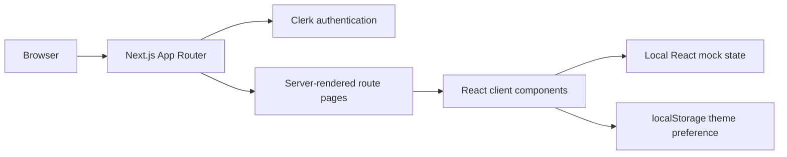
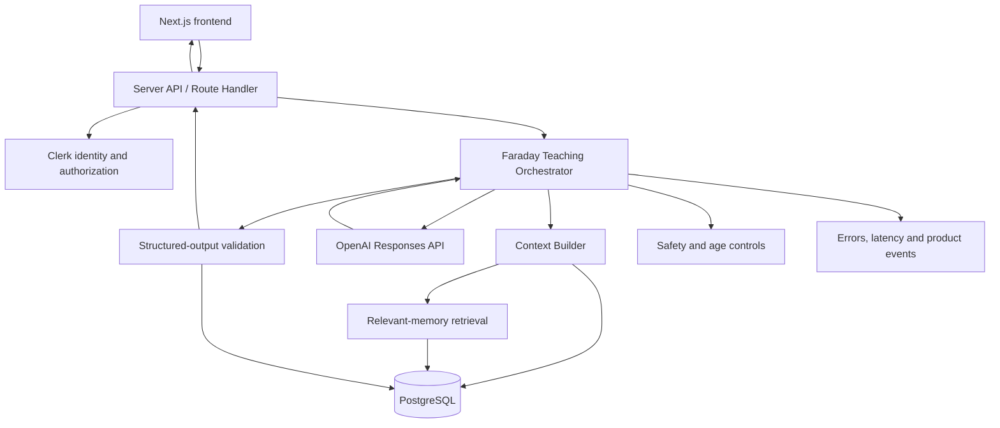

# System architecture

## Product boundary

Faraday is a personal AI teacher. Its core product loop is:

```text
Choose a topic
  → discover the student's starting point and preferred style
  → teach one concept
  → check understanding
  → adapt the next teaching action
  → remember useful evidence
  → continue from the right place later
```

The language model produces explanations and questions. The Faraday application owns student identity, memory, mastery, lesson state, safety rules, and the decision about what context the model receives.

## Current architecture



### Implemented

- Next.js App Router application.
- Public marketing and information pages.
- Clerk sign-in, sign-up, protected dashboard, and user button.
- Separate dashboard routes for learning, lessons, suggestions, progress, tests, memory, and settings.
- Interactive prototype lesson, test, memory, and preference flows.
- Persistent light/dark preference in `localStorage`.

### Not implemented yet

- No model API is called.
- No lesson or conversation API exists.
- No database or durable student memory exists.
- No mastery calculation or recommendation engine exists.
- Refreshing the page resets prototype learning state.

## Target architecture



## Main runtime responsibilities

| Layer | Owns | Must not own |
|---|---|---|
| Frontend | Rendering, input, optimistic UI, streaming display | API secrets, mastery decisions, trusted memory writes |
| API layer | Authentication, validation, rate limits, response streaming | Teaching policy embedded in route files |
| Teaching Orchestrator | Next-action decisions, context assembly, model calls | UI layout |
| Model | Language generation and constrained analysis | Authoritative student records or direct database access |
| Database | Durable profile, lesson, evidence, mastery and memory records | Generating teaching content |

## Model strategy

The planned primary teaching model is `gpt-6-sol` through the OpenAI Responses API. It is intended to balance teaching quality, latency, and operating cost. `gpt-6-luna` may later handle high-volume background work such as summaries, tagging, and memory-candidate extraction. Model identifiers must be configuration values rather than scattered literals.

This is a **planned choice**, not a current integration. Before implementation, confirm model availability for the project account and record any change here.

## Request lifecycle

1. The browser sends a typed action such as `start_topic`, `answer_check`, or `ask_follow_up`.
2. The server verifies the Clerk user and validates the request.
3. The Context Builder loads only the relevant student profile, preferences, active topic, mastery evidence, and session summary.
4. The Teaching Orchestrator chooses an action: diagnose, teach, check, remediate, recap, or finish.
5. The model receives stable teacher instructions plus the assembled context.
6. The model returns a schema-constrained result; it never writes directly to storage.
7. The server validates the result, stores approved evidence and events, and returns a UI-safe response.
8. The frontend renders the response using known card types.

## Trust boundaries

- `OPENAI_API_KEY` and database credentials are server-only.
- The browser cannot submit a mastery score or permanent memory as an authoritative fact.
- Model output is untrusted until schema and safety validation succeeds.
- Raw chat history is not the student model. Durable memory must be explicit, typed, inspectable, and deletable.
- Student-facing claims should eventually be grounded in approved curriculum sources for factual lessons.

## Architectural principles

1. Build one complete adaptive lesson loop before expanding features.
2. Keep model providers behind a small adapter so models can be evaluated or replaced.
3. Store learning evidence, not vague AI opinions.
4. Retrieve the smallest useful context instead of sending a student's entire history every turn.
5. Make every memory visible and editable by the student.
6. Use structured outputs between the model and application.
7. Keep prototype and production behavior clearly labeled.
