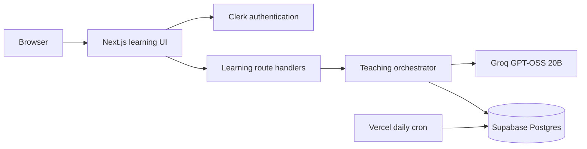

# System architecture

The browser never receives model or database secrets. A Start a Topic session begins with an age-13+ pilot notice and grade selection, generates subtopic cards, then persists every current lesson card server-side. The context builder sends the current grade, style, topic, compact summary, limited relevant memory, and recent turns to Groq—not the whole history.

Groq output is strict JSON and is validated before it becomes a card. The server, not the model, controls ownership, confidence updates, completion, and safe memory writes. Raw lesson turns expire after 90 days; progress, summaries, and safe memories remain until the student uses the deletion control.

Other dashboard pages currently remain prototype UI. Do not present their hard-coded information as live student data.
